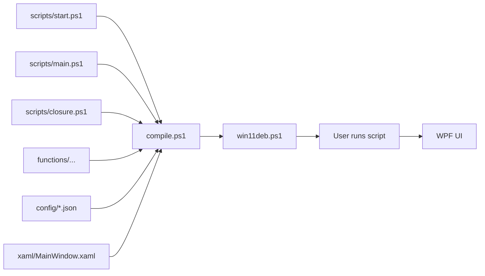

# Windows11-Optimizer-Debloater

[](https://github.com/vukilis/Windows11-Optimizer-Debloater/blob/dev/CHANGELOG.md) 
[](https://github.com/ungive/discord-music-presence/releases)
[](https://github.com/ungive/discord-music-presence/releases/latest)
[](https://star-history.com/#ungive/discord-music-presence&Date)
[](https://star-history.com/#ungive/discord-music-presence&Date) [](https://www.microsoft.com/windows/windows-11)
[](https://buymeacoffee.com/vukilis)
[](https://ko-fi.com/vukilis)

This Utility show basic system information, install programs, debloat and optimize Windows with tweaks, troubleshoot with config, and fix Windows updates.


## Usage:

Requires you to launch PowerShell or Windows Terminal As ADMINISTRATOR!

Stable Branch (recommended):
```
iwr -useb vukilis.com/win11deb | iex
```

Development Branch:
```
iwr -useb vukilis.com/win11dev | iex
```

---

## What Script Do?

| Feature | Description |
|---------|-------------|
| ℹ️ **Info** | Shows system information |
| 📦 **Install** | Install applications from winget and choco |
| 🧹 **Debloat** | Removes unnecessary preinstalled apps |
| ⚡ **Optimization** | Optimizes Windows and reduces running processes<br>Has different presets |
| 🔄 **Updates** | Fixes the default Windows update scheme<br>Reset Windows Update to factory settings<br>Pauses Windows updates to 5 weeks |
| ⚙️ **Config** | Quick configurations for Windows Installs<br>Has old legacy panels from Windows 7<br>Makes shortcuts and backups<br>Fixes and sets configs for applications<br>Activate Windows with MAS script |

--- 

## Architecture

This project uses a **compile-time concatenation** architecture. Source files are organized by function and compiled into a single artifact.



### Key Design Decisions

| Decision | Description |
|----------|-------------|
| 📦 **Single Artifact** | All code is compiled into `win11deb.ps1` for easy distribution |
| 📋 **JSON-Driven** | Tweaks and configurations are defined in JSON, not hardcoded |
| 🖼️ **Local XAML** | UI layout is loaded from `xaml/MainWindow.xaml` with GitHub fallback |
| 🔗 **Dictionary Routing** | Button actions are mapped via hashtables instead of switch statements |

---

## Development

| Resource | Description |
|----------|-------------|
| 📝 [CONTRIBUTING.md](CONTRIBUTING.md) | Contribution guidelines and workflow |
| 🛠️ [docs/DEVELOPMENT.md](docs/DEVELOPMENT.md) | Development setup and guidelines |

---

## Blog Post

| Resource | Description |
|----------|-------------|
| 📄 **[Windows 11 Optimizer & Debloater](https://vukilis.com/blog/2024/windows-11-optimizer-debloater/)** | In-depth article about the project |

---

## Credits

| Credit | Description |
|--------|-------------|
| 🖱️ **[jepriCreations](https://www.deviantart.com/rosea92)** | Windows 11 cursor concept<br>[Free version](https://www.deviantart.com/jepricreations/art/Windows-11-Free-Tail-Cursor-Concept-962242647) • [HD version](https://www.deviantart.com/jepricreations/art/Windows-11-Cursors-Concept-HD-v2-890672103) |
| ⚡ **[massgravel](https://github.com/massgravel)** | Windows and Office activator<br>[Microsoft Activation Scripts](https://github.com/massgravel/Microsoft-Activation-Scripts) |
